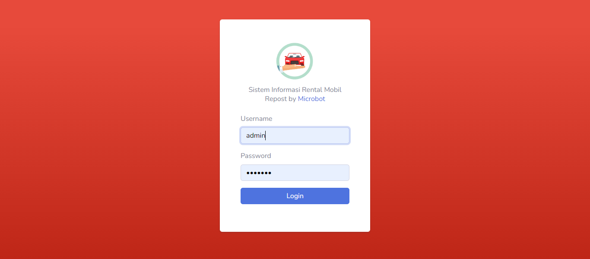

## Car Rental

Aplikasi Rental Mobil berbasis web dibangun dengan laravel 5.8 dan Mysql

## Fiitur :

1. Management Pengguna
2. Management Mobil
3. Management Customer
4. Management Transaksi
5. Management List Transaksi Aktif
5. Management History Transaksi
6. Management Setting Aplikasi
7. Management Print Kuitansi Transaksi
8. Management Export Data Transaksi Via Excel
9. Integrasi dengan website (optional)

## Panduan Instalasi :

1. Copy folder RentalMobil yang sudah didownload digithub, lalu paste ke folder htdocs.
2. Aktifkan Apache dan MySQL pada Xampp.
3. buka folder RentalMobil Menggunakan VS Code dan buka terminal
4. ketikan "npm Install"
5. buka database Mysql buat database baru rentalmobil
6. ketikan "php artisan migrate", untuk membuat table database
7. ketikan "php artisan db:seed", untuk seeding isi database
8. lanjutkan dengan "php artisan serve", untuk menjalankan aplikasinya
9. dan terakhir akan berjalan di "http://127.0.0.1:8000"
10. Login dengan "email : admin, Password : rahasia"
11. untuk register ada didalam aplikasinya
12. ganti file ".env.exampe" menjadi ".env"
